```python
import pandas as pd
import seaborn as sns
import matplotlib.pyplot as plt
from sklearn.cluster import KMeans
import warnings
warnings.filterwarnings('ignore')
```


```python
df = pd.read_csv("C:/Users/ADERONKE/Downloads/Mall_Customers.csv")
```

# UNIVARIATE ANALYSIS


```python
df.describe()
```


<div>
<style scoped>
    .dataframe tbody tr th:only-of-type {
        vertical-align: middle;
    }

    .dataframe tbody tr th {
        vertical-align: top;
    }

    .dataframe thead th {
        text-align: right;
    }
</style>
<table border="1" class="dataframe">
  <thead>
    <tr style="text-align: right;">
      <th></th>
      <th>CustomerID</th>
      <th>Age</th>
      <th>Annual Income (k$)</th>
      <th>Spending Score (1-100)</th>
    </tr>
  </thead>
  <tbody>
    <tr>
      <th>count</th>
      <td>200.000000</td>
      <td>200.000000</td>
      <td>200.000000</td>
      <td>200.000000</td>
    </tr>
    <tr>
      <th>mean</th>
      <td>100.500000</td>
      <td>38.850000</td>
      <td>60.560000</td>
      <td>50.200000</td>
    </tr>
    <tr>
      <th>std</th>
      <td>57.879185</td>
      <td>13.969007</td>
      <td>26.264721</td>
      <td>25.823522</td>
    </tr>
    <tr>
      <th>min</th>
      <td>1.000000</td>
      <td>18.000000</td>
      <td>15.000000</td>
      <td>1.000000</td>
    </tr>
    <tr>
      <th>25%</th>
      <td>50.750000</td>
      <td>28.750000</td>
      <td>41.500000</td>
      <td>34.750000</td>
    </tr>
    <tr>
      <th>50%</th>
      <td>100.500000</td>
      <td>36.000000</td>
      <td>61.500000</td>
      <td>50.000000</td>
    </tr>
    <tr>
      <th>75%</th>
      <td>150.250000</td>
      <td>49.000000</td>
      <td>78.000000</td>
      <td>73.000000</td>
    </tr>
    <tr>
      <th>max</th>
      <td>200.000000</td>
      <td>70.000000</td>
      <td>137.000000</td>
      <td>99.000000</td>
    </tr>
  </tbody>
</table>
</div>


```python
df.head()
```


<div>
<style scoped>
    .dataframe tbody tr th:only-of-type {
        vertical-align: middle;
    }

    .dataframe tbody tr th {
        vertical-align: top;
    }

    .dataframe thead th {
        text-align: right;
    }
</style>
<table border="1" class="dataframe">
  <thead>
    <tr style="text-align: right;">
      <th></th>
      <th>CustomerID</th>
      <th>Gender</th>
      <th>Age</th>
      <th>Annual Income (k$)</th>
      <th>Spending Score (1-100)</th>
    </tr>
  </thead>
  <tbody>
    <tr>
      <th>0</th>
      <td>1</td>
      <td>Male</td>
      <td>19</td>
      <td>15</td>
      <td>39</td>
    </tr>
    <tr>
      <th>1</th>
      <td>2</td>
      <td>Male</td>
      <td>21</td>
      <td>15</td>
      <td>81</td>
    </tr>
    <tr>
      <th>2</th>
      <td>3</td>
      <td>Female</td>
      <td>20</td>
      <td>16</td>
      <td>6</td>
    </tr>
    <tr>
      <th>3</th>
      <td>4</td>
      <td>Female</td>
      <td>23</td>
      <td>16</td>
      <td>77</td>
    </tr>
    <tr>
      <th>4</th>
      <td>5</td>
      <td>Female</td>
      <td>31</td>
      <td>17</td>
      <td>40</td>
    </tr>
  </tbody>
</table>
</div>


```python
df.columns
```


    Index(['CustomerID', 'Gender', 'Age', 'Annual Income (k$)',
           'Spending Score (1-100)'],
          dtype='object')


```python
sns.distplot(df['Annual Income (k$)'])
```


    <AxesSubplot:xlabel='Annual Income (k$)', ylabel='Density'>


    
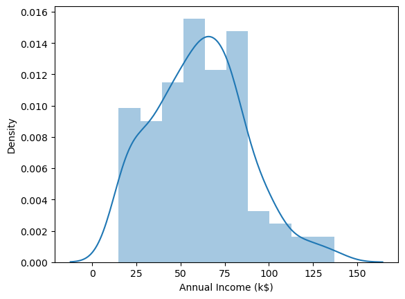
    


```python
sns.displot(df['Annual Income (k$)'])
```


    <seaborn.axisgrid.FacetGrid at 0x24d5f6127f0>


    
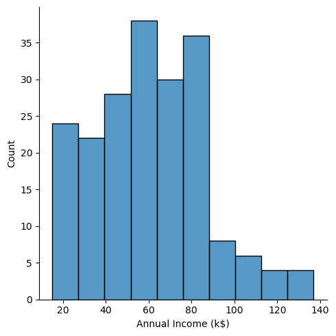
    


```python
columns = ['Age', 'Annual Income (k$)','Spending Score (1-100)']
for i in columns:
    plt.figure()
    sns.distplot(df[i])
```


    
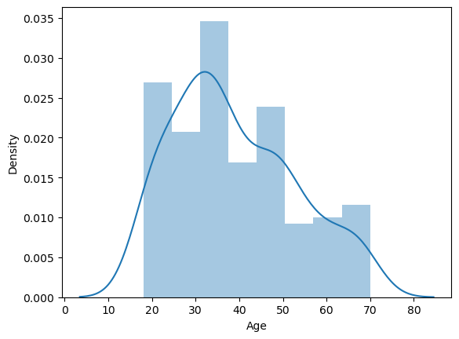
    


    

    


    
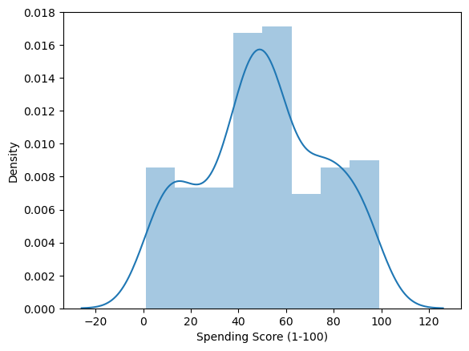
    


```python
sns.kdeplot(df['Annual Income (k$)'],shade=True);
```


    
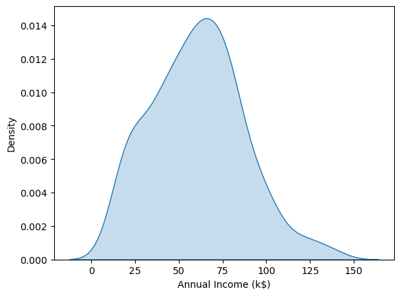
    


```python
sns.kdeplot(df['Annual Income (k$)'],shade=True,hue=df['Gender']);
```


    
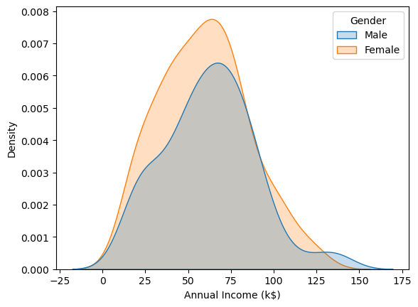
    


```python
columns = ['Age', 'Annual Income (k$)','Spending Score (1-100)']
for i in columns:
    plt.figure()
sns.kdeplot(df['Annual Income (k$)'],shade=True,hue=df['Gender']);    
```


    <Figure size 640x480 with 0 Axes>


    <Figure size 640x480 with 0 Axes>


    

    


```python
columns = ['Age', 'Annual Income (k$)','Spending Score (1-100)']
for i in columns:
    plt.figure()
    sns.boxplot(data=df,x='Gender',y=df[i])
```


    
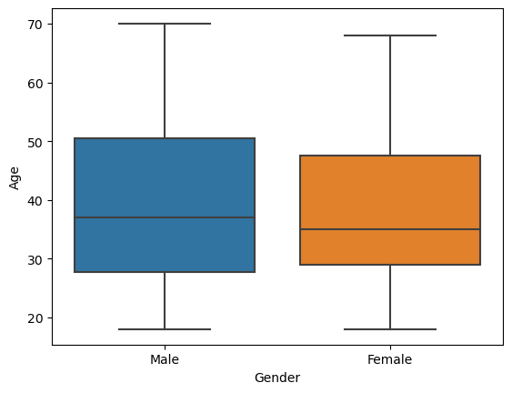
    


    
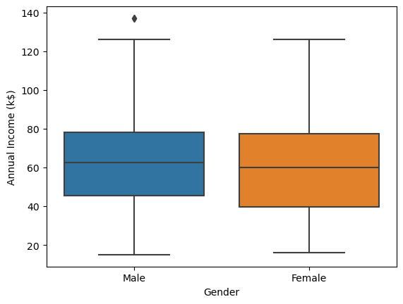
    


    
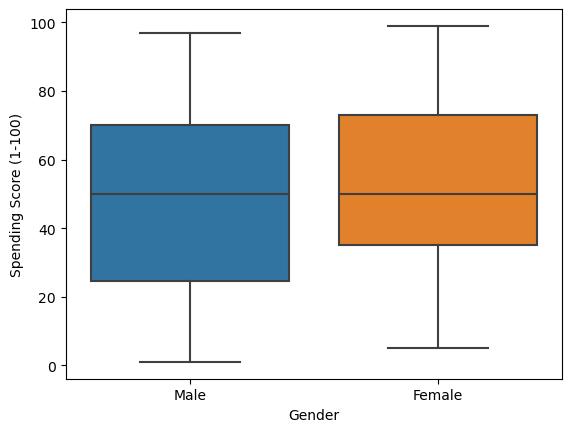
    


```python
df['Gender'].value_counts()
```


    Female    112
    Male       88
    Name: Gender, dtype: int64


```python
df['Gender'].value_counts(normalize=True)
```


    Female    0.56
    Male      0.44
    Name: Gender, dtype: float64


# Bivariate Analysis


```python
sns.scatterplot(data=df, x='Annual Income (k$)',y='Spending Score (1-100)')
```


    <AxesSubplot:xlabel='Annual Income (k$)', ylabel='Spending Score (1-100)'>


    
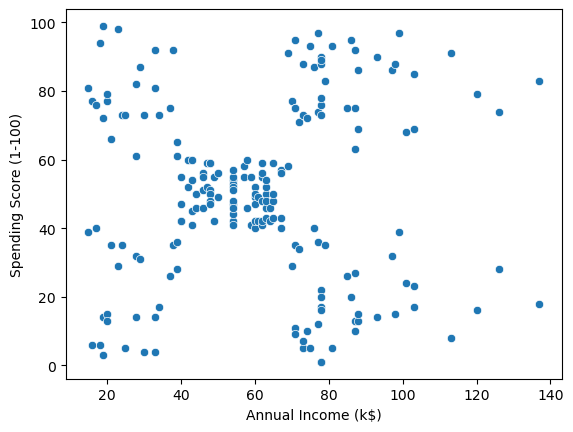
    


```python
sns.pairplot(df)
```


    <seaborn.axisgrid.PairGrid at 0x24d6564d1c0>


    
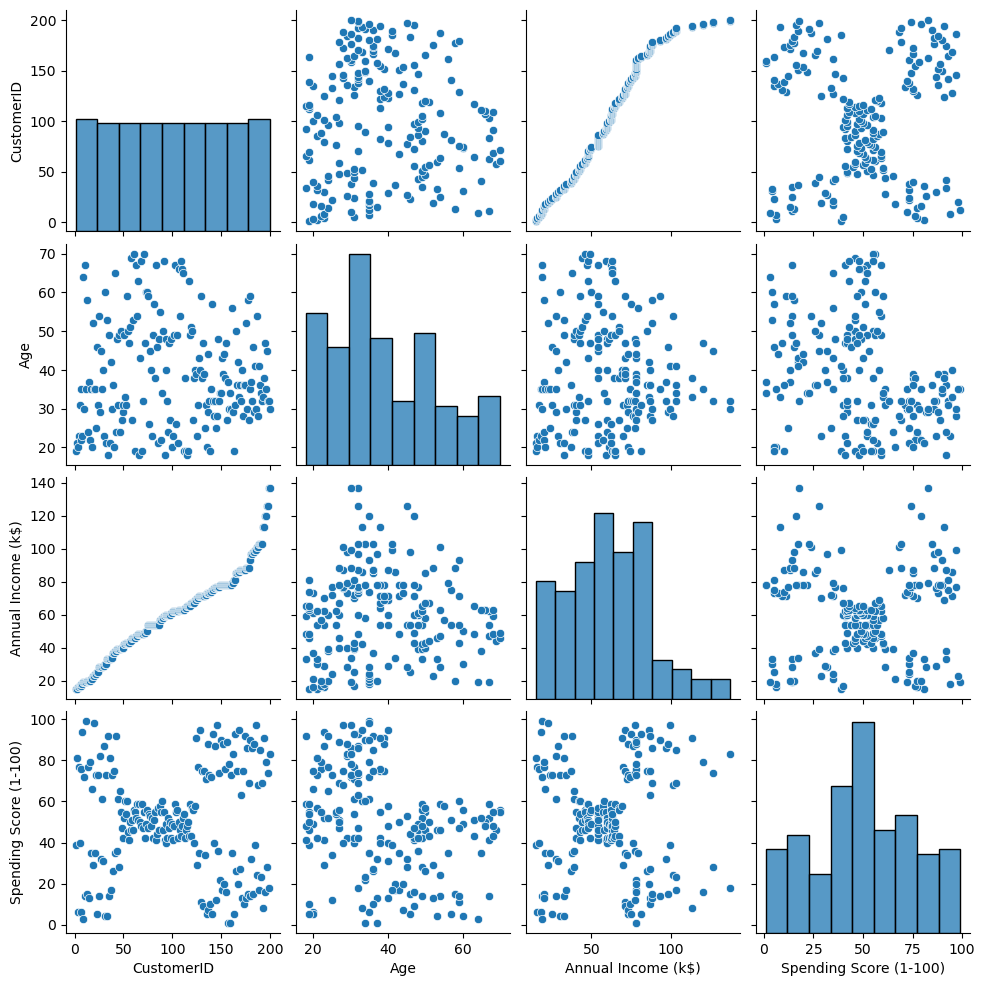
    


```python
df=df.drop('CustomerID',axis=1)
sns.pairplot(df)
```


    <seaborn.axisgrid.PairGrid at 0x24d671359d0>


    
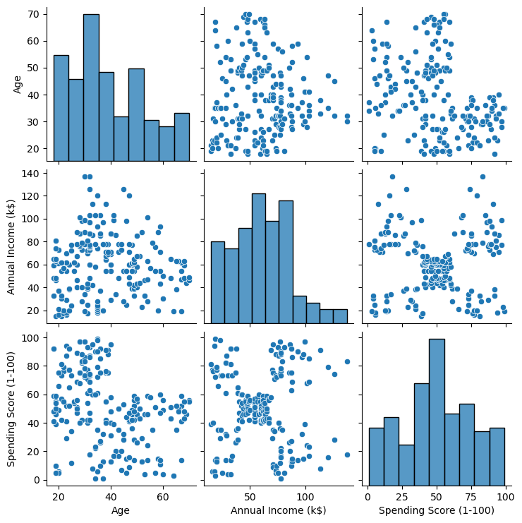
    


```python
#df=df.drop('CustomerID',axis=1)
sns.pairplot(df,hue='Gender')
```


    <seaborn.axisgrid.PairGrid at 0x24d6570a310>


    
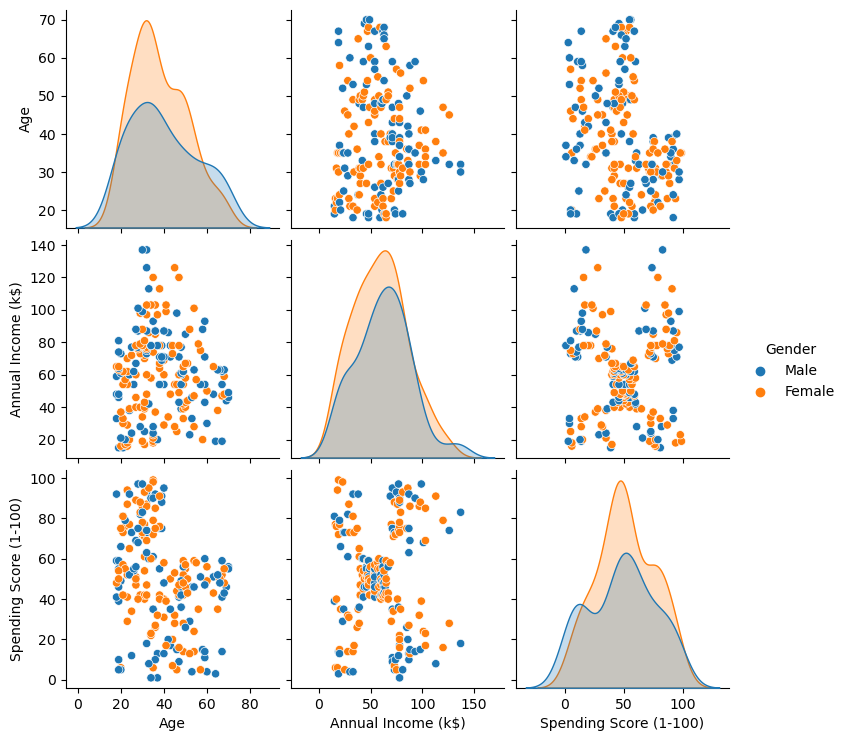
    


```python
df.groupby(['Gender'])['Age', 'Annual Income (k$)','Spending Score (1-100)'].mean()
```


<div>
<style scoped>
    .dataframe tbody tr th:only-of-type {
        vertical-align: middle;
    }

    .dataframe tbody tr th {
        vertical-align: top;
    }

    .dataframe thead th {
        text-align: right;
    }
</style>
<table border="1" class="dataframe">
  <thead>
    <tr style="text-align: right;">
      <th></th>
      <th>Age</th>
      <th>Annual Income (k$)</th>
      <th>Spending Score (1-100)</th>
    </tr>
    <tr>
      <th>Gender</th>
      <th></th>
      <th></th>
      <th></th>
    </tr>
  </thead>
  <tbody>
    <tr>
      <th>Female</th>
      <td>38.098214</td>
      <td>59.250000</td>
      <td>51.526786</td>
    </tr>
    <tr>
      <th>Male</th>
      <td>39.806818</td>
      <td>62.227273</td>
      <td>48.511364</td>
    </tr>
  </tbody>
</table>
</div>


```python
df.corr()
```


<div>
<style scoped>
    .dataframe tbody tr th:only-of-type {
        vertical-align: middle;
    }

    .dataframe tbody tr th {
        vertical-align: top;
    }

    .dataframe thead th {
        text-align: right;
    }
</style>
<table border="1" class="dataframe">
  <thead>
    <tr style="text-align: right;">
      <th></th>
      <th>Age</th>
      <th>Annual Income (k$)</th>
      <th>Spending Score (1-100)</th>
    </tr>
  </thead>
  <tbody>
    <tr>
      <th>Age</th>
      <td>1.000000</td>
      <td>-0.012398</td>
      <td>-0.327227</td>
    </tr>
    <tr>
      <th>Annual Income (k$)</th>
      <td>-0.012398</td>
      <td>1.000000</td>
      <td>0.009903</td>
    </tr>
    <tr>
      <th>Spending Score (1-100)</th>
      <td>-0.327227</td>
      <td>0.009903</td>
      <td>1.000000</td>
    </tr>
  </tbody>
</table>
</div>


```python
sns.heatmap(df.corr(),annot=True,cmap='coolwarm')
```


    <AxesSubplot:>


    
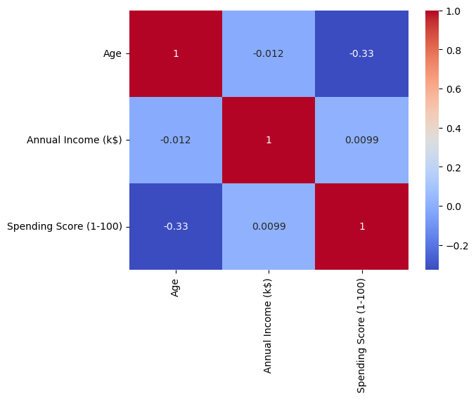
    


# Clustering-Univariate,Bivariate,Multivariate


```python
clustering1 = KMeans()
```


```python
clustering1 = KMeans(n_clusters=3)
```


```python
clustering1.fit(df[['Annual Income (k$)']])
```


    KMeans(n_clusters=3)


```python
clustering1.labels_
```


    array([1, 1, 1, 1, 1, 1, 1, 1, 1, 1, 1, 1, 1, 1, 1, 1, 1, 1, 1, 1, 1, 1,
           1, 1, 1, 1, 1, 1, 1, 1, 1, 1, 1, 1, 1, 1, 1, 1, 1, 1, 1, 1, 1, 1,
           1, 1, 1, 1, 1, 1, 1, 1, 1, 1, 1, 1, 1, 1, 1, 1, 1, 1, 1, 1, 1, 1,
           1, 1, 1, 1, 1, 1, 1, 1, 2, 2, 2, 2, 2, 2, 2, 2, 2, 2, 2, 2, 2, 2,
           2, 2, 2, 2, 2, 2, 2, 2, 2, 2, 2, 2, 2, 2, 2, 2, 2, 2, 2, 2, 2, 2,
           2, 2, 2, 2, 2, 2, 2, 2, 2, 2, 2, 2, 2, 2, 2, 2, 2, 2, 2, 2, 2, 2,
           2, 2, 2, 2, 2, 2, 2, 2, 2, 2, 2, 2, 2, 2, 2, 2, 2, 2, 2, 2, 2, 2,
           2, 2, 2, 2, 2, 2, 2, 2, 2, 2, 0, 0, 0, 0, 0, 0, 0, 0, 0, 0, 0, 0,
           0, 0, 0, 0, 0, 0, 0, 0, 0, 0, 0, 0, 0, 0, 0, 0, 0, 0, 0, 0, 0, 0,
           0, 0])


```python
df['Income cluster'] = clustering1.labels_
df.head()
```


<div>
<style scoped>
    .dataframe tbody tr th:only-of-type {
        vertical-align: middle;
    }

    .dataframe tbody tr th {
        vertical-align: top;
    }

    .dataframe thead th {
        text-align: right;
    }
</style>
<table border="1" class="dataframe">
  <thead>
    <tr style="text-align: right;">
      <th></th>
      <th>Gender</th>
      <th>Age</th>
      <th>Annual Income (k$)</th>
      <th>Spending Score (1-100)</th>
      <th>Income cluster</th>
    </tr>
  </thead>
  <tbody>
    <tr>
      <th>0</th>
      <td>Male</td>
      <td>19</td>
      <td>15</td>
      <td>39</td>
      <td>1</td>
    </tr>
    <tr>
      <th>1</th>
      <td>Male</td>
      <td>21</td>
      <td>15</td>
      <td>81</td>
      <td>1</td>
    </tr>
    <tr>
      <th>2</th>
      <td>Female</td>
      <td>20</td>
      <td>16</td>
      <td>6</td>
      <td>1</td>
    </tr>
    <tr>
      <th>3</th>
      <td>Female</td>
      <td>23</td>
      <td>16</td>
      <td>77</td>
      <td>1</td>
    </tr>
    <tr>
      <th>4</th>
      <td>Female</td>
      <td>31</td>
      <td>17</td>
      <td>40</td>
      <td>1</td>
    </tr>
  </tbody>
</table>
</div>


```python
df['Income cluster'].value_counts()
```


    2    90
    1    74
    0    36
    Name: Income cluster, dtype: int64


```python
inertia_scores=[]
for i in range(1,11):
    kmeans=KMeans(n_clusters=i)
    kmeans.fit(df[['Annual Income (k$)']])
    inertia_scores.append(kmeans.inertia_)
```


```python
inertia_scores
```


    [137277.28000000003,
     48660.88888888889,
     23517.330930930926,
     13278.112713472487,
     8493.229304029304,
     5443.614973544974,
     3931.988095238096,
     2822.4996947496943,
     2234.450395682749,
     1758.812049062049]


```python
plt.plot(range(1,11),inertia_scores)
```


    [<matplotlib.lines.Line2D at 0x24d685057f0>]


    
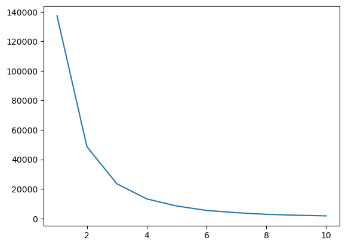
    


# Bivariate Clustering


```python
clustering2 = KMeans(n_clusters=5)
clustering2.fit(df[['Annual Income (k$)','Spending Score (1-100)']])
df['Spending and Income Cluster'] = clustering2.labels_
df.head()
```


<div>
<style scoped>
    .dataframe tbody tr th:only-of-type {
        vertical-align: middle;
    }

    .dataframe tbody tr th {
        vertical-align: top;
    }

    .dataframe thead th {
        text-align: right;
    }
</style>
<table border="1" class="dataframe">
  <thead>
    <tr style="text-align: right;">
      <th></th>
      <th>Gender</th>
      <th>Age</th>
      <th>Annual Income (k$)</th>
      <th>Spending Score (1-100)</th>
      <th>Income cluster</th>
      <th>Spending and Income Cluster</th>
    </tr>
  </thead>
  <tbody>
    <tr>
      <th>0</th>
      <td>Male</td>
      <td>19</td>
      <td>15</td>
      <td>39</td>
      <td>1</td>
      <td>0</td>
    </tr>
    <tr>
      <th>1</th>
      <td>Male</td>
      <td>21</td>
      <td>15</td>
      <td>81</td>
      <td>1</td>
      <td>3</td>
    </tr>
    <tr>
      <th>2</th>
      <td>Female</td>
      <td>20</td>
      <td>16</td>
      <td>6</td>
      <td>1</td>
      <td>0</td>
    </tr>
    <tr>
      <th>3</th>
      <td>Female</td>
      <td>23</td>
      <td>16</td>
      <td>77</td>
      <td>1</td>
      <td>3</td>
    </tr>
    <tr>
      <th>4</th>
      <td>Female</td>
      <td>31</td>
      <td>17</td>
      <td>40</td>
      <td>1</td>
      <td>0</td>
    </tr>
  </tbody>
</table>
</div>


```python
inertia_scores2=[]
for i in range(1,11):
    kmeans2=KMeans(n_clusters=i)
    kmeans2.fit(df[['Annual Income (k$)','Spending Score (1-100)']])
    inertia_scores2.append(kmeans2.inertia_)
    plt.plot(range(1,11),inertia_scores)
```


    

    


```python
sns.scatterplot(data=df, x = 'Annual Income (k$)',y='Spending Score (1-100)')
```


    <AxesSubplot:xlabel='Annual Income (k$)', ylabel='Spending Score (1-100)'>


    

    


```python
clustering2.cluster_centers_
```


    array([[26.30434783, 20.91304348],
           [88.2       , 17.11428571],
           [55.2962963 , 49.51851852],
           [25.72727273, 79.36363636],
           [86.53846154, 82.12820513]])


```python
centers = pd.DataFrame(clustering2.cluster_centers_)
centers
```


<div>
<style scoped>
    .dataframe tbody tr th:only-of-type {
        vertical-align: middle;
    }

    .dataframe tbody tr th {
        vertical-align: top;
    }

    .dataframe thead th {
        text-align: right;
    }
</style>
<table border="1" class="dataframe">
  <thead>
    <tr style="text-align: right;">
      <th></th>
      <th>0</th>
      <th>1</th>
    </tr>
  </thead>
  <tbody>
    <tr>
      <th>0</th>
      <td>26.304348</td>
      <td>20.913043</td>
    </tr>
    <tr>
      <th>1</th>
      <td>88.200000</td>
      <td>17.114286</td>
    </tr>
    <tr>
      <th>2</th>
      <td>55.296296</td>
      <td>49.518519</td>
    </tr>
    <tr>
      <th>3</th>
      <td>25.727273</td>
      <td>79.363636</td>
    </tr>
    <tr>
      <th>4</th>
      <td>86.538462</td>
      <td>82.128205</td>
    </tr>
  </tbody>
</table>
</div>


```python
centers = pd.DataFrame(clustering2.cluster_centers_)
centers.columns = ['x','y']
```


```python
plt.figure(figsize=(10,8))
plt.scatter(x=centers['x'],y=centers['y'],s=100,c='black',marker='*')
sns.scatterplot(data=df, x = 'Annual Income (k$)', y='Spending Score (1-100)',hue='Spending and Income Cluster',palette ='tab10')
plt.savefig('Clustering_bivaraiate.png')
```


    
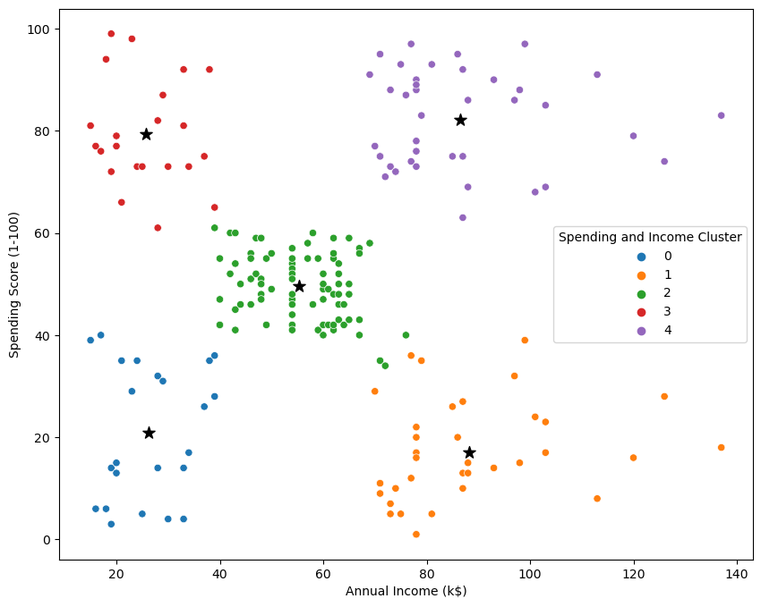
    


```python
pd.crosstab(df['Spending and Income Cluster'],df['Gender'],normalize='index')
```


<div>
<style scoped>
    .dataframe tbody tr th:only-of-type {
        vertical-align: middle;
    }

    .dataframe tbody tr th {
        vertical-align: top;
    }

    .dataframe thead th {
        text-align: right;
    }
</style>
<table border="1" class="dataframe">
  <thead>
    <tr style="text-align: right;">
      <th>Gender</th>
      <th>Female</th>
      <th>Male</th>
    </tr>
    <tr>
      <th>Spending and Income Cluster</th>
      <th></th>
      <th></th>
    </tr>
  </thead>
  <tbody>
    <tr>
      <th>0</th>
      <td>0.608696</td>
      <td>0.391304</td>
    </tr>
    <tr>
      <th>1</th>
      <td>0.457143</td>
      <td>0.542857</td>
    </tr>
    <tr>
      <th>2</th>
      <td>0.592593</td>
      <td>0.407407</td>
    </tr>
    <tr>
      <th>3</th>
      <td>0.590909</td>
      <td>0.409091</td>
    </tr>
    <tr>
      <th>4</th>
      <td>0.538462</td>
      <td>0.461538</td>
    </tr>
  </tbody>
</table>
</div>


```python
df.groupby('Spending and Income Cluster')['Age', 'Annual Income (k$)','Spending Score (1-100)'].mean()
```


<div>
<style scoped>
    .dataframe tbody tr th:only-of-type {
        vertical-align: middle;
    }

    .dataframe tbody tr th {
        vertical-align: top;
    }

    .dataframe thead th {
        text-align: right;
    }
</style>
<table border="1" class="dataframe">
  <thead>
    <tr style="text-align: right;">
      <th></th>
      <th>Age</th>
      <th>Annual Income (k$)</th>
      <th>Spending Score (1-100)</th>
    </tr>
    <tr>
      <th>Spending and Income Cluster</th>
      <th></th>
      <th></th>
      <th></th>
    </tr>
  </thead>
  <tbody>
    <tr>
      <th>0</th>
      <td>45.217391</td>
      <td>26.304348</td>
      <td>20.913043</td>
    </tr>
    <tr>
      <th>1</th>
      <td>41.114286</td>
      <td>88.200000</td>
      <td>17.114286</td>
    </tr>
    <tr>
      <th>2</th>
      <td>42.716049</td>
      <td>55.296296</td>
      <td>49.518519</td>
    </tr>
    <tr>
      <th>3</th>
      <td>25.272727</td>
      <td>25.727273</td>
      <td>79.363636</td>
    </tr>
    <tr>
      <th>4</th>
      <td>32.692308</td>
      <td>86.538462</td>
      <td>82.128205</td>
    </tr>
  </tbody>
</table>
</div>


```python
#Multivariate clustering
from sklearn.preprocessing import StandardScaler
```


```python
df.head()
```


<div>
<style scoped>
    .dataframe tbody tr th:only-of-type {
        vertical-align: middle;
    }

    .dataframe tbody tr th {
        vertical-align: top;
    }

    .dataframe thead th {
        text-align: right;
    }
</style>
<table border="1" class="dataframe">
  <thead>
    <tr style="text-align: right;">
      <th></th>
      <th>Gender</th>
      <th>Age</th>
      <th>Annual Income (k$)</th>
      <th>Spending Score (1-100)</th>
      <th>Income cluster</th>
      <th>Spending and Income Cluster</th>
    </tr>
  </thead>
  <tbody>
    <tr>
      <th>0</th>
      <td>Male</td>
      <td>19</td>
      <td>15</td>
      <td>39</td>
      <td>1</td>
      <td>0</td>
    </tr>
    <tr>
      <th>1</th>
      <td>Male</td>
      <td>21</td>
      <td>15</td>
      <td>81</td>
      <td>1</td>
      <td>3</td>
    </tr>
    <tr>
      <th>2</th>
      <td>Female</td>
      <td>20</td>
      <td>16</td>
      <td>6</td>
      <td>1</td>
      <td>0</td>
    </tr>
    <tr>
      <th>3</th>
      <td>Female</td>
      <td>23</td>
      <td>16</td>
      <td>77</td>
      <td>1</td>
      <td>3</td>
    </tr>
    <tr>
      <th>4</th>
      <td>Female</td>
      <td>31</td>
      <td>17</td>
      <td>40</td>
      <td>1</td>
      <td>0</td>
    </tr>
  </tbody>
</table>
</div>


```python
dff = pd.get_dummies(df,drop_first=True)
dff.head()
```


<div>
<style scoped>
    .dataframe tbody tr th:only-of-type {
        vertical-align: middle;
    }

    .dataframe tbody tr th {
        vertical-align: top;
    }

    .dataframe thead th {
        text-align: right;
    }
</style>
<table border="1" class="dataframe">
  <thead>
    <tr style="text-align: right;">
      <th></th>
      <th>Age</th>
      <th>Annual Income (k$)</th>
      <th>Spending Score (1-100)</th>
      <th>Income cluster</th>
      <th>Spending and Income Cluster</th>
      <th>Gender_Male</th>
    </tr>
  </thead>
  <tbody>
    <tr>
      <th>0</th>
      <td>19</td>
      <td>15</td>
      <td>39</td>
      <td>1</td>
      <td>0</td>
      <td>1</td>
    </tr>
    <tr>
      <th>1</th>
      <td>21</td>
      <td>15</td>
      <td>81</td>
      <td>1</td>
      <td>3</td>
      <td>1</td>
    </tr>
    <tr>
      <th>2</th>
      <td>20</td>
      <td>16</td>
      <td>6</td>
      <td>1</td>
      <td>0</td>
      <td>0</td>
    </tr>
    <tr>
      <th>3</th>
      <td>23</td>
      <td>16</td>
      <td>77</td>
      <td>1</td>
      <td>3</td>
      <td>0</td>
    </tr>
    <tr>
      <th>4</th>
      <td>31</td>
      <td>17</td>
      <td>40</td>
      <td>1</td>
      <td>0</td>
      <td>0</td>
    </tr>
  </tbody>
</table>
</div>


```python
dff.columns
```


    Index(['Age', 'Annual Income (k$)', 'Spending Score (1-100)', 'Income cluster',
           'Spending and Income Cluster', 'Gender_Male'],
          dtype='object')


```python
dff = dff[['Age', 'Annual Income (k$)','Spending Score (1-100)','Gender_Male']]
dff.head()
```


<div>
<style scoped>
    .dataframe tbody tr th:only-of-type {
        vertical-align: middle;
    }

    .dataframe tbody tr th {
        vertical-align: top;
    }

    .dataframe thead th {
        text-align: right;
    }
</style>
<table border="1" class="dataframe">
  <thead>
    <tr style="text-align: right;">
      <th></th>
      <th>Age</th>
      <th>Annual Income (k$)</th>
      <th>Spending Score (1-100)</th>
      <th>Gender_Male</th>
    </tr>
  </thead>
  <tbody>
    <tr>
      <th>0</th>
      <td>19</td>
      <td>15</td>
      <td>39</td>
      <td>1</td>
    </tr>
    <tr>
      <th>1</th>
      <td>21</td>
      <td>15</td>
      <td>81</td>
      <td>1</td>
    </tr>
    <tr>
      <th>2</th>
      <td>20</td>
      <td>16</td>
      <td>6</td>
      <td>0</td>
    </tr>
    <tr>
      <th>3</th>
      <td>23</td>
      <td>16</td>
      <td>77</td>
      <td>0</td>
    </tr>
    <tr>
      <th>4</th>
      <td>31</td>
      <td>17</td>
      <td>40</td>
      <td>0</td>
    </tr>
  </tbody>
</table>
</div>


```python
dff 
```


<div>
<style scoped>
    .dataframe tbody tr th:only-of-type {
        vertical-align: middle;
    }

    .dataframe tbody tr th {
        vertical-align: top;
    }

    .dataframe thead th {
        text-align: right;
    }
</style>
<table border="1" class="dataframe">
  <thead>
    <tr style="text-align: right;">
      <th></th>
      <th>Age</th>
      <th>Annual Income (k$)</th>
      <th>Spending Score (1-100)</th>
      <th>Gender_Male</th>
    </tr>
  </thead>
  <tbody>
    <tr>
      <th>0</th>
      <td>19</td>
      <td>15</td>
      <td>39</td>
      <td>1</td>
    </tr>
    <tr>
      <th>1</th>
      <td>21</td>
      <td>15</td>
      <td>81</td>
      <td>1</td>
    </tr>
    <tr>
      <th>2</th>
      <td>20</td>
      <td>16</td>
      <td>6</td>
      <td>0</td>
    </tr>
    <tr>
      <th>3</th>
      <td>23</td>
      <td>16</td>
      <td>77</td>
      <td>0</td>
    </tr>
    <tr>
      <th>4</th>
      <td>31</td>
      <td>17</td>
      <td>40</td>
      <td>0</td>
    </tr>
    <tr>
      <th>...</th>
      <td>...</td>
      <td>...</td>
      <td>...</td>
      <td>...</td>
    </tr>
    <tr>
      <th>195</th>
      <td>35</td>
      <td>120</td>
      <td>79</td>
      <td>0</td>
    </tr>
    <tr>
      <th>196</th>
      <td>45</td>
      <td>126</td>
      <td>28</td>
      <td>0</td>
    </tr>
    <tr>
      <th>197</th>
      <td>32</td>
      <td>126</td>
      <td>74</td>
      <td>1</td>
    </tr>
    <tr>
      <th>198</th>
      <td>32</td>
      <td>137</td>
      <td>18</td>
      <td>1</td>
    </tr>
    <tr>
      <th>199</th>
      <td>30</td>
      <td>137</td>
      <td>83</td>
      <td>1</td>
    </tr>
  </tbody>
</table>
<p>200 rows × 4 columns</p>
</div>


```python
df
```


<div>
<style scoped>
    .dataframe tbody tr th:only-of-type {
        vertical-align: middle;
    }

    .dataframe tbody tr th {
        vertical-align: top;
    }

    .dataframe thead th {
        text-align: right;
    }
</style>
<table border="1" class="dataframe">
  <thead>
    <tr style="text-align: right;">
      <th></th>
      <th>Gender</th>
      <th>Age</th>
      <th>Annual Income (k$)</th>
      <th>Spending Score (1-100)</th>
      <th>Income cluster</th>
      <th>Spending and Income Cluster</th>
    </tr>
  </thead>
  <tbody>
    <tr>
      <th>0</th>
      <td>Male</td>
      <td>19</td>
      <td>15</td>
      <td>39</td>
      <td>1</td>
      <td>0</td>
    </tr>
    <tr>
      <th>1</th>
      <td>Male</td>
      <td>21</td>
      <td>15</td>
      <td>81</td>
      <td>1</td>
      <td>3</td>
    </tr>
    <tr>
      <th>2</th>
      <td>Female</td>
      <td>20</td>
      <td>16</td>
      <td>6</td>
      <td>1</td>
      <td>0</td>
    </tr>
    <tr>
      <th>3</th>
      <td>Female</td>
      <td>23</td>
      <td>16</td>
      <td>77</td>
      <td>1</td>
      <td>3</td>
    </tr>
    <tr>
      <th>4</th>
      <td>Female</td>
      <td>31</td>
      <td>17</td>
      <td>40</td>
      <td>1</td>
      <td>0</td>
    </tr>
    <tr>
      <th>...</th>
      <td>...</td>
      <td>...</td>
      <td>...</td>
      <td>...</td>
      <td>...</td>
      <td>...</td>
    </tr>
    <tr>
      <th>195</th>
      <td>Female</td>
      <td>35</td>
      <td>120</td>
      <td>79</td>
      <td>0</td>
      <td>4</td>
    </tr>
    <tr>
      <th>196</th>
      <td>Female</td>
      <td>45</td>
      <td>126</td>
      <td>28</td>
      <td>0</td>
      <td>1</td>
    </tr>
    <tr>
      <th>197</th>
      <td>Male</td>
      <td>32</td>
      <td>126</td>
      <td>74</td>
      <td>0</td>
      <td>4</td>
    </tr>
    <tr>
      <th>198</th>
      <td>Male</td>
      <td>32</td>
      <td>137</td>
      <td>18</td>
      <td>0</td>
      <td>1</td>
    </tr>
    <tr>
      <th>199</th>
      <td>Male</td>
      <td>30</td>
      <td>137</td>
      <td>83</td>
      <td>0</td>
      <td>4</td>
    </tr>
  </tbody>
</table>
<p>200 rows × 6 columns</p>
</div>


```python
df.to_csv('Clustering.csv')
```
